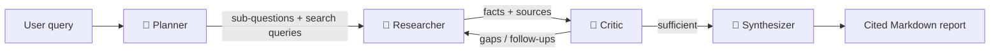

# 🛰️ Atlas — Autonomous Research Agent

> A multi-agent system that **plans**, **researches the live web**, **self-critiques** for gaps, and writes a **fully-cited report** — built to run entirely on **free** API tiers.

Atlas is not "RAG chatbot #17". It's an agentic pipeline that mirrors how a careful analyst actually works: break the question down, gather evidence from real sources, challenge its own findings, then synthesize a referenced answer.

---

## ✨ Demo

> _Replace this with your screen recording / GIF._
>
> ``

---

## 🧠 How it works

Atlas runs a four-agent pipeline. Each stage has a single, well-defined job:



| Agent | Responsibility | Why it matters |
|-------|----------------|----------------|
| **🧭 Planner** | Decomposes the query into 3–6 focused sub-questions, each with concrete search queries. | Explicit decomposition is what separates an *agent* from a single search call. |
| **🔎 Researcher** | Runs web search, extracts clean content, and pulls out source-attributed facts. | Facts are grounded in real URLs — the LLM can only cite sources it actually read. |
| **🧪 Critic** | Reviews coverage, flags gaps & conflicts, and triggers follow-up research. | This self-correction loop is the core "agentic" behavior. |
| **📄 Synthesizer** | Streams a structured, cited Markdown report with a confidence assessment. | Output is verifiable and recruiter-readable. |

---

## 🚀 Quickstart

### 1. Install
```powershell
python -m venv .venv
.\.venv\Scripts\Activate.ps1
pip install -r requirements.txt
```

### 2. Add a free API key
Copy the template and add **one** free LLM key (Groq recommended):
```powershell
Copy-Item .env.example .env
```
Then edit `.env` — see [Credentials](#-credentials-all-free) below.

### 3. Run
```powershell
streamlit run app.py
```
Open the local URL Streamlit prints (usually `http://localhost:8501`).

---

## 🔑 Credentials (all free)

| Service | Required? | Free tier | Where to get it |
|---------|-----------|-----------|-----------------|
| **Groq** | ✅ (recommended primary) | Generous free tier, very fast | https://console.groq.com/keys |
| **Google Gemini** | Alternative to Groq | Free tier | https://aistudio.google.com/apikey |
| **Brave Search** | ❌ optional | 2,000 queries/mo | https://brave.com/search/api/ |
| **Jina Reader** | ❌ optional | Works with **no key** | https://jina.ai/reader/ |

> You only need **one LLM key** to run Atlas. If no Brave key is set, search automatically falls back to **DuckDuckGo** (free, no key). Jina Reader works without a key.

---

## 📊 Evaluation

Atlas ships with an evaluation harness measuring three complementary signals:

1. **Citation quality** (objective, free): source count, coverage, invalid citations, density.
2. **LLM-as-judge** (1–10): accuracy, completeness, coherence, citation quality.
3. **Speed**: wall-clock seconds per query.

```powershell
python -m evaluation.evaluator --limit 3   # quick smoke run
python -m evaluation.evaluator             # full suite
```
Results print to the console and save to `evaluation/results/eval_<timestamp>.md`.

---

## ☁️ Deploy (free)

**Streamlit Community Cloud** (recommended):
1. Push this repo to GitHub.
2. Go to https://share.streamlit.io → **New app** → pick the repo and `app.py`.
3. In **Advanced settings → Secrets**, paste your keys:
   ```toml
   GROQ_API_KEY = "your_key"
   LLM_PROVIDER = "groq"
   ```
4. Deploy. (Note: outbound web search/scraping must be allowed by the host.)

---

## 🏗️ Tech stack

- **LLMs** via OpenAI-compatible endpoints — Groq / Gemini / OpenAI are swappable with one client.
- **Search**: Brave Search API with DuckDuckGo fallback.
- **Extraction**: Jina Reader (clean Markdown) with a BeautifulSoup fallback.
- **UI**: Streamlit with a custom glassmorphism theme + live agent status + streamed report.
- **Validation**: Pydantic models for every inter-agent payload.

---

## 📁 Project structure

```
research-agent/
├── app.py                  # Streamlit UI (live pipeline + streamed report)
├── config.py               # Providers, model tiers, limits, cost tables
├── requirements.txt
├── .env.example            # Copy to .env and add your free keys
├── src/
│   ├── models.py           # Pydantic data models
│   ├── llm/client.py       # Unified multi-provider LLM client
│   ├── tools/
│   │   ├── search.py       # Brave + DuckDuckGo
│   │   └── extract.py      # Jina Reader + fallback
│   ├── agents/
│   │   ├── planner.py
│   │   ├── researcher.py
│   │   ├── critic.py
│   │   └── synthesizer.py
│   └── pipeline.py         # Orchestrates the four agents
├── evaluation/
│   ├── test_queries.py     # Curated, category-tagged query suite
│   └── evaluator.py        # Citation + LLM-judge + speed
└── assets/styles.css       # Custom UI theme
```

---

## 💸 Cost

Built to cost **₹0 / $0** to run: free LLM tiers (Groq/Gemini), free search (DuckDuckGo or Brave free tier), keyless extraction (Jina). The UI still surfaces a *production-equivalent* cost estimate — a deliberate nod to cost-aware engineering.

---

## 📄 License

MIT — see [LICENSE](LICENSE).
