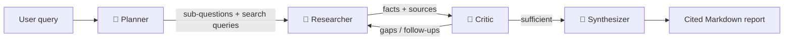

# 🛰️ Atlas — Autonomous Research Agent

**A multi-agent AI system that plans a research strategy, gathers evidence from the live web, critiques its own findings for gaps, and writes a fully-cited report — running entirely on free LLM tiers.**

[](https://atlas-research-agent.streamlit.app/)
&nbsp;
[](https://www.python.org/)
&nbsp;
[](https://streamlit.io/)

---

Atlas isn't a chatbot that answers from memory, and it isn't "RAG demo #17." It's an **agentic pipeline** that works the way a careful analyst does: break the question down, gather real evidence, **challenge its own conclusions**, and cite every claim. Built to demonstrate production-grade thinking about multi-agent orchestration, grounding, evaluation, and cost.

## 🎬 See it in action

> **▶ Live app:** **[atlas-research-agent.streamlit.app](https://atlas-research-agent.streamlit.app/)**
>
> _2-minute walkthrough video coming soon._

<!-- TODO: paste the demo video / GIF link here once recorded. -->

---

## Why this is interesting

- **It's genuinely agentic.** A Critic agent reviews the gathered evidence, detects gaps and contradictions, and **sends the system back to do more research** before writing — real self-correction, not a one-shot chain.
- **It can't hallucinate citations.** Every fact is tied to a URL the Researcher actually opened; the model can only cite sources it was handed. No invented references.
- **It's production-minded.** Each run surfaces its sources with credibility scores plus full telemetry — tokens, API calls, latency, and a production-equivalent cost estimate.
- **It runs for $0.** Free LLM tiers (Gemini/Groq), free search (DuckDuckGo or Brave free tier), keyless extraction (Jina Reader) — with rate-limit pacing and cross-model failover so it stays reliable.

---

## 🧠 How it works

Atlas runs a four-agent pipeline. Each stage has a single, well-defined job:



| Agent | Responsibility | Why it matters |
|-------|----------------|----------------|
| **🧭 Planner** | Decomposes the query into 3–6 focused sub-questions, each with concrete search queries. | Explicit decomposition is what separates an *agent* from a single search call. |
| **🔎 Researcher** | Runs web search, extracts clean content, and pulls out source-attributed facts. | Facts are grounded in real URLs — the LLM can only cite sources it actually read. |
| **🧪 Critic** | Reviews coverage, flags gaps & conflicts, and triggers follow-up research. | This self-correction loop is the core "agentic" behavior. |
| **📄 Synthesizer** | Streams a structured, cited Markdown report with a confidence assessment. | Output is verifiable and recruiter-readable. |

---

## ⚙️ Engineering highlights

The decisions that took this from "works on my machine" to a reliable, demoable system:

- **Provider-agnostic LLM layer** — Gemini, Groq, and OpenAI sit behind one OpenAI-compatible client, swappable via config.
- **Cross-model failover + rate-limit pacing** — free-tier quotas are per-model, so the client paces requests, honors server retry delays, and rotates models when one is throttled.
- **Grounded extraction** — Jina Reader turns messy web pages into clean Markdown (BeautifulSoup fallback); every fact maps back to a real source index.
- **Graceful degradation** — Brave Search falls back to DuckDuckGo with no key; tight timeouts prevent hangs; failures surface as clear, actionable UI messages.
- **Evaluation harness** — scores citation quality, an LLM-as-judge rubric (accuracy / completeness / coherence), and speed across a curated query suite.
- **Typed contracts** — Pydantic models validate every payload passed between agents.

---

## 🧰 Tech stack

**Python · Streamlit · Multi-agent orchestration · Google Gemini / Groq · Pydantic · Brave Search + DuckDuckGo · Jina Reader**

---

## 🚀 Run it yourself

<details>
<summary><b>Local setup</b> — one free API key, ~2 minutes</summary>

<br />

```bash
python -m venv .venv
# Windows:        .\.venv\Scripts\python.exe -m pip install -r requirements.txt
# macOS / Linux:  source .venv/bin/activate && pip install -r requirements.txt

cp .env.example .env        # then add one free key (Gemini or Groq)
streamlit run app.py
```

- **Gemini key:** https://aistudio.google.com/apikey
- **Groq key:** https://console.groq.com/keys
- Search works with no key (DuckDuckGo); extraction works with no key (Jina Reader).
- You only need **one** LLM key. Run the evaluation suite with `python -m evaluation.evaluator --limit 3`.

</details>

<details>
<summary><b>Deploy free on Streamlit Community Cloud</b></summary>

<br />

1. Push to GitHub, then create an app at https://share.streamlit.io pointing to `app.py`.
2. In **Settings → Secrets**, add your current key (see [`.streamlit/secrets.toml.example`](.streamlit/secrets.toml.example)):

   ```toml
   GEMINI_API_KEY = "your_current_key"
   LLM_PROVIDER = "gemini"
   ```

</details>

---

## 📄 License

MIT — see [LICENSE](LICENSE). Built from scratch by **[Sameer Surla](https://github.com/sameersurla-iitm)**.
